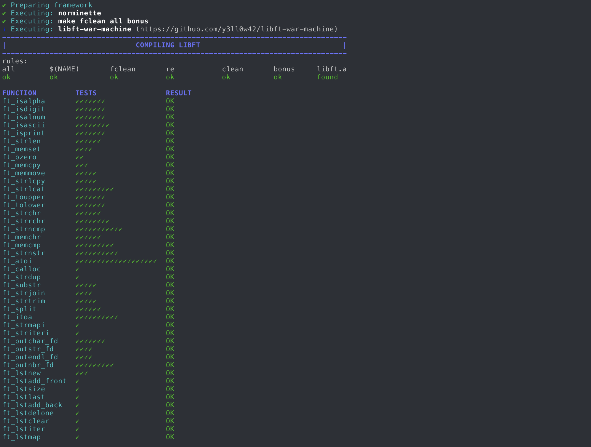
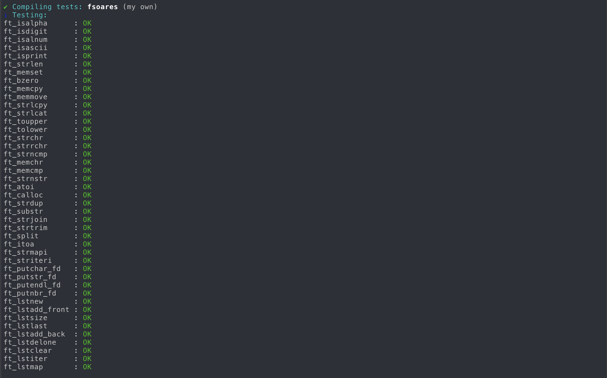

# Fonctions abordees

## Index

* [Fonctions de Base](#fonctions-de-base-manipulation-de-caract%C3%A8res-et-de-m%C3%A9moire-)
* [Fonctions de Gestion de la Mémoire](#fonctions-de-gestion-de-m%C3%A9moire-allocation-et-lib%C3%A9ration-)
* [Fonctions de Manipulation de Chaînes de Caractères](#fonctions-de-manipulation-de-cha%C3%AEnes-de-caract%C3%A8res-)
* [Fonctions de Liste Chaînée (Partie Bonus)](#fonctions-de-liste-cha%C3%AEn%C3%A9e-partie-bonus-)
* [Résultats des tests](#resultats-des-tests)
* [Moulinette](#moulinette)
* [Liens utiles](#liens-utiles)

## Fonctions de Base (Manipulation de Caractères et de Mémoire) :

- [x] **isalpha** : `int ft_isalpha(int c);` Vérifie si le caractère passé en argument est une lettre alphabétique.  
- [x] **isdigit** : `int ft_isdigit(int c);` Vérifie si le caractère passé en argument est un chiffre décimal.  
- [x] **isalnum** : `int ft_isalnum(int c);` Vérifie si le caractère passé en argument est un caractère alphanumérique.  
- [x] **isascii** : `int ft_isascii(int c);` Vérifie si le caractère passé en argument est un caractère ASCII.  
- [x] **isprint** : `int ft_isprint(int c);` Vérifie si le caractère passé en argument est un caractère imprimable.  
- [x] **strlen** : `size_t ft_strlen(const char *s);` Calcule la longueur d'une chaîne de caractères.  
- [x] **memset** : `void *ft_memset(void *b, int c, size_t len);` Remplit une zone mémoire avec une valeur donnée.  
- [x] **bzero** : `void ft_bzero(void *s, size_t n);` Remplit les premiers octets de la mémoire pointée par `s` avec l'octet nul (valeur 0).  
- [x] **memcpy** : `void *ft_memcpy(void *dst, const void *src, size_t n);` Copie une zone mémoire source dans une zone mémoire destination.  
- [x] **memmove** : `void *ft_memmove(void *dst, const void *src, size_t len);` Copie une zone mémoire source dans une zone mémoire destination, même si elles se chevauchent. 
- [x] **strlcpy** : `size_t ft_strlcpy(char *dst, const char *src, size_t dstsize);` Copie une chaîne de caractères dans une autre en limitant la taille de destination. 
- [x] **strlcat** : `size_t ft_strlcat(char *dest, const char *src, size_t dstsize);` Concatène deux chaînes de caractères en limitant la taille du résultat. 
- [x] **toupper** : `int ft_toupper(int c);` Convertit un caractère minuscule en caractère majuscule si c'est une lettre minuscule. 
- [x] **tolower** : `int ft_tolower(int c);` Convertit un caractère majuscule en caractère minuscule si c'est une lettre majuscule. 
- [x] **strchr** : `char *ft_strchr(const char *s, int c);` Recherche la première occurrence d'un caractère dans une chaîne de caractères. 
- [x] **strrchr** : `char *ft_strrchr(const char *s, int c);` Recherche la dernière occurrence d'un caractère dans une chaîne de caractères. 
- [x] **strncmp** : `int ft_strncmp(const char *s1, const char *s2, size_t n);` Compare les n premiers caractères de deux chaînes de caractères. 
- [x] **memchr** : `void *ft_memchr(const void *s, int c, size_t n);` Recherche une valeur dans une zone mémoire. 
- [x] **memcmp** : `int ft_memcmp(const void *s1, const void *s2, size_t n);` Compare les n premiers octets de deux zones mémoire. 
- [x] **strnstr** : `char *ft_strnstr(const char *haystack, const char *needle, size_t len);` Recherche une sous-chaîne dans une chaîne avec une limite de longueur. 
- [x] **atoi** : `int ft_atoi(const char *str);` Convertit une chaîne de caractères en un entier. 

## Fonctions de Gestion de Mémoire (Allocation et Libération) :

- [x] **calloc** : `void *ft_calloc(size_t count, size_t size);` Alloue et initialise un bloc de mémoire à zéro. 
- [x] **strdup** : `char *ft_strdup(const char *s1);` Duplique une chaîne de caractères. 

## Fonctions de Manipulation de Chaînes de Caractères :

- [x] **substr** : `char *ft_substr(char const *s, unsigned int start, size_t len);` Extrait une sous-chaîne d'une chaîne de caractères. 
- [x] **strjoin** : `char *ft_strjoin(char const *s1, char const *s2);` Concatène deux chaînes de caractères. 
- [x] **strtrim** : `char *ft_strtrim(char const *s1, char const *set);` Supprime les caractères spécifiés en début et en fin d'une chaîne de caractères. 
- [x] **split** : `char **ft_split(char const *s, char c);` Divise une chaîne de caractères en mots en utilisant un caractère délimiteur. 
- [x] **itoa** : `char *ft_itoa(int n);` Convertit un entier en chaîne de caractères. 
- [x] **strmapi** : `char *ft_strmapi(char const *s, char (*f)(unsigned int, char));` Applique une fonction à chaque caractère d'une chaîne avec son index en argument. 
- [x] **striteri** : `void ft_striteri(char *s, void (*f)(unsigned int, char *));` Applique une fonction à chaque caractère d'une chaîne avec son index en argument.

## Fonctions de Liste Chaînée (Partie Bonus) :

- [x] **lstnew** : `t_list *ft_lstnew(void *content);` Crée un nouvel élément de liste avec la donnée passée en argument. 
- [x] **lstadd\_front** : `void ft_lstadd_front(t_list **lst, t_list *new);` Ajoute un nouvel élément au début de la liste. 
- [x] **lstsize** : `int ft_lstsize(t_list *lst);` Calcule la taille de la liste en comptant le nombre d'éléments. 
- [x] **lstlast** : `t_list *ft_lstlast(t_list *lst);` Renvoie un pointeur vers le dernier élément de la liste. 
- [x] **lstadd\_back** : `void ft_lstadd_back(t_list **lst, t_list *new);` Ajoute un élément à la fin de la liste chaînée. 
- [x] **lstdelone** : `void ft_lstdelone(t_list *lst, void (*del)(void *));` Supprime un élément de la liste sans supprimer la structure de données qu'il contenait. 
- [x] **lstclear** : `void ft_lstclear(t_list **lst, void (*del)(void *));` Supprime et libère la mémoire de tous les éléments de la liste en utilisant une fonction de suppression. 
- [x] **lstiter** : `void ft_lstiter(t_list *lst, void (*f)(void *))` Applique la fonction 'f' à chaque 'content' de 'lst'. 
- [x] **lstmap** : `t_list *ft_lstmap(t_list *lst, void *(*f)(void *), void (*del)(void *))` Applique la fonction 'f' à chaque élément de la liste, crée une nouvelle liste avec les résultats et retourne un pointeur vers la nouvelle liste. En cas d'échec d'allocation mémoire, libère la nouvelle liste ainsi que son contenu en utilisant 'del' et renvoie NULL.

# Resultats des tests

# Moulinette

|          Note          |            Tests            |
|:----------------------:|:---------------------------:|
|  |  |

# Liens utiles

## Liens Github

[Norminette 42](https://github.com/42School/norminette)
Norminette 42 pour le Terminal. 
[Francinette](https://github.com/xicodomingues/francinette)
Programme de different tests des modules du Cursus 42.

## Extensions VSCode

[42\_ft\_line\_counter](https://marketplace.visualstudio.com/items?itemName=DoKca.42-ft-count-line)
Compteur de lignes par fonction (utile pour la Norminette). 
[42\_header](https://marketplace.visualstudio.com/items?itemName=kube.42header)
Header de l'école 42. 
[Norminette 42](https://marketplace.visualstudio.com/items?itemName=dalexhd.42-norminette)
Norminette non-officielle pour VSCode.

- - -

### DON'T COPY. LEARN.
